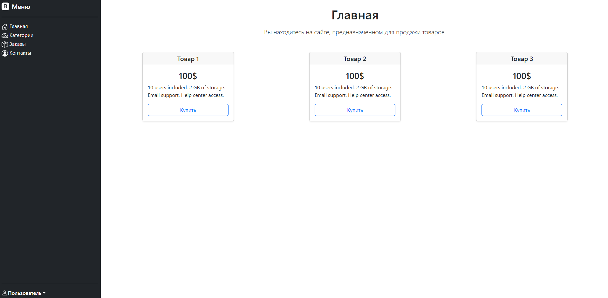
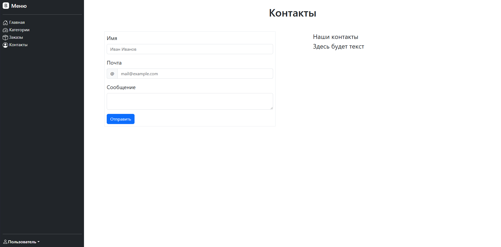

## Онлайн-магазин на Django

### Используемые технологии:  


  

# ПРОЕКТ В ПРОЦЕССЕ РАЗРАБОТКИ, КОД И README ИМЕЕЕТ НЕОКОНЧАТЕЛЬНЫЙ ВИД.

## Установка и использование:  

Требования для работы с проектом:  
- Python 3.10+
- Poetry
- Git


Клонируйте репозиторий к себе на компьютер
```
git clone https://github.com/MrProdeon/DjangoProject.git
cd online-store
```  
Установите зависимости с помощью poetry
```
poetry install
```  
Активируйте виртуальное окружение с помощью ```poetry shell``` или создайте
интерпритатор для данных зависимостей и активируйте его.

Запуск сервера разработки
```
python manage.py runserver
```
# API и маршруты

| Метод      | URL               | Контроллер  | Описание                       |
|------------|-------------------|-------------|--------------------------------|
| GET        | `/`               | `home_page` | Главная страница магазина      |
| GET/POST   | `/contact/`       | `contact`   | Страница контактов с формой    |
| POST       | `/contact/submit/`| `contact`   | Обработка данных формы         |


# Функционал проекта:


- Приложение "Каталог"

1) Отображение главной страницы онлайн-магазина  
Для этого используется контроллер home_page, который рендерит главную страницу
по созданному шаблону home.html  
Страница отображается сразу при переходе на сайт, без указания дополнительных префиксов и url.  



2) Отображение страницы контактов.
Для этого используется контроллер contact, который рендерит главную страницу
по созданному шаблону contacts.html  
Страница отображается с добавлением /contacts/ к основному url.



На страницу контактов добавлена обработка отправки формы. При нажатии кнопки
пользователя отправки на html-страницу с надписью "Данные успешно отправлены"

## Тесты
На данный момент тесты не написаны.

## Документация и ссылки  
Документация Django: https://docs.djangoproject.com/en/6.0/  
Документация Bootstrap: https://getbootstrap.com/docs/5.3/getting-started/introduction/


## Лицензия
На данный момент у проекта нет лицензии